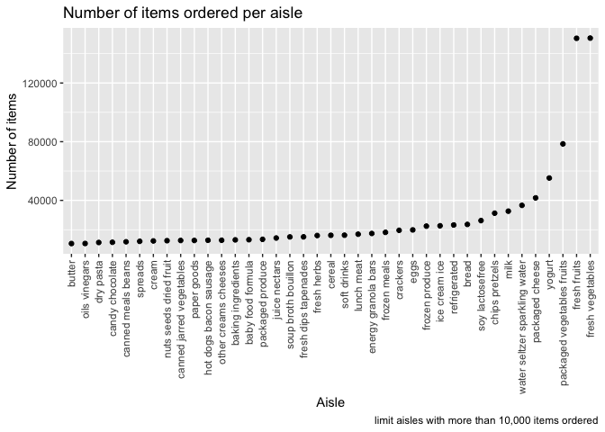
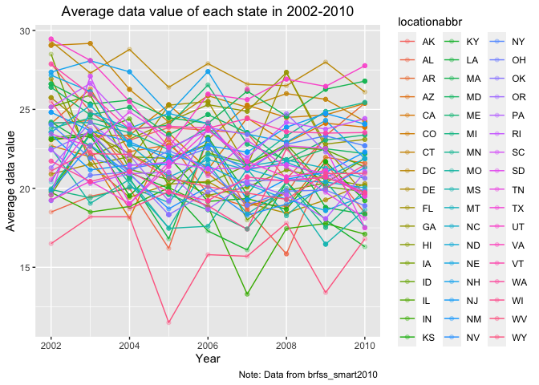
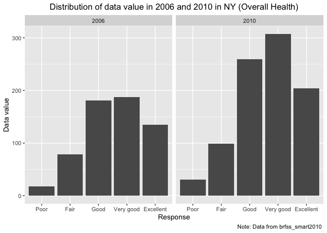
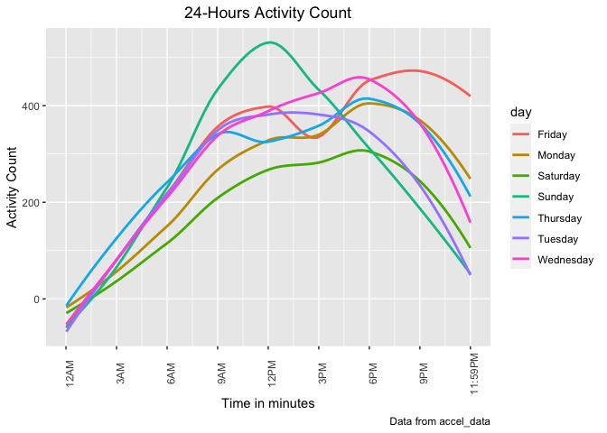

p8105\_hw3\_js5962
================
Jiayao Sun
2021-10-18

**Problem 1**

1.  How many aisles are there, and which aisles are the most items
    ordered from?

``` r
data("instacart")

# How many aisles are there, and which aisles are the most items ordered from?
instacart %>%
  count(aisle) %>%
  arrange(desc(n))
```

    ## # A tibble: 134 × 2
    ##    aisle                              n
    ##    <chr>                          <int>
    ##  1 fresh vegetables              150609
    ##  2 fresh fruits                  150473
    ##  3 packaged vegetables fruits     78493
    ##  4 yogurt                         55240
    ##  5 packaged cheese                41699
    ##  6 water seltzer sparkling water  36617
    ##  7 milk                           32644
    ##  8 chips pretzels                 31269
    ##  9 soy lactosefree                26240
    ## 10 bread                          23635
    ## # … with 124 more rows

*Comment:* 134 aisles in total.

2.  Then, make a plot that shows the number of items ordered in each
    aisle, limiting this to aisles with more than 10000 items ordered.
    Arrange aisles sensibly, and organize your plot so others can read
    it.

``` r
instacart %>% 
    count(aisle) %>% 
    filter(n > 10000) %>% 
    mutate(
        aisle = factor(aisle),
        aisle = fct_reorder(aisle, n)
    ) %>% 
    ggplot(aes(x = aisle, y = n)) + 
    geom_point() + 
    theme(axis.text.x = element_text(angle = 90, vjust = 0.5, hjust = 1)) +
  labs(
    title = "Number of items ordered per aisle",
    x = "Aisle",
    y = "Number of items",
    caption = "limit aisles with more than 10,000 items ordered")
```

<!-- -->

*Comment:* Among aisles with more than 10,000 items ordered, top three
ordered aisles are Fresh vegetables, Fresh fruits, and packaged
vegetables and fruits; butter has smallest number of items ordered.

3.  Next, make a table showing the three most popular items in each of
    the aisles “baking ingredients”, “dog food care”, and “packaged
    vegetables fruits”. Include the number of times each item is ordered
    in your table.

``` r
instacart %>% 
    filter(
      aisle %in% 
        c("baking ingredients", "dog food care", "packaged vegetables fruits")) %>% 
    group_by(aisle) %>% 
    count(product_name) %>% 
    mutate(rank = min_rank(desc(n))) %>% 
    filter(rank <= 3) %>% 
    arrange(aisle, rank) %>% 
    knitr::kable()
```

| aisle                      | product\_name                                 |    n | rank |
|:---------------------------|:----------------------------------------------|-----:|-----:|
| baking ingredients         | Light Brown Sugar                             |  499 |    1 |
| baking ingredients         | Pure Baking Soda                              |  387 |    2 |
| baking ingredients         | Cane Sugar                                    |  336 |    3 |
| dog food care              | Snack Sticks Chicken & Rice Recipe Dog Treats |   30 |    1 |
| dog food care              | Organix Chicken & Brown Rice Recipe           |   28 |    2 |
| dog food care              | Small Dog Biscuits                            |   26 |    3 |
| packaged vegetables fruits | Organic Baby Spinach                          | 9784 |    1 |
| packaged vegetables fruits | Organic Raspberries                           | 5546 |    2 |
| packaged vegetables fruits | Organic Blueberries                           | 4966 |    3 |

*Comment:* n represents for the number of product ordered. Rank means
the rank of products in its aisles. We can find that suger and soda are
most popular in baking ingredients. Dog food care sells most in chicken
& rice recipe. Packaged vagetables fruits sells most in organic foods,
especially organic baby spinach.

4.  Next, make a table showing the mean hour of the day at which Pink
    Lady Apples and Coffee Ice Cream are ordered on each day of the
    week; format this table for human readers (i.e. produce a 2 x 7
    table).

``` r
instacart %>% 
    filter(
      product_name %in% 
        c("Pink Lady Apples", "Coffee Ice Cream")) %>% 
  group_by(product_name, order_dow) %>%  # the day of the week on which the order was placed
  summarize(mean_hour = mean(order_hour_of_day)) %>% # the hour of the day on which the order was placed
    pivot_wider(
        names_from = order_dow,
        values_from = mean_hour
    ) %>%
  rename(Sunday = "0", Monday = "1", Tuesday = "2", Wednesday = "3", Thursday = "4", Friday = "5", Saturday = "6") %>% 
  knitr::kable()
```

| product\_name    |   Sunday |   Monday |  Tuesday | Wednesday | Thursday |   Friday | Saturday |
|:-----------------|---------:|---------:|---------:|----------:|---------:|---------:|---------:|
| Coffee Ice Cream | 13.77419 | 14.31579 | 15.38095 |  15.31818 | 15.21739 | 12.26316 | 13.83333 |
| Pink Lady Apples | 13.44118 | 11.36000 | 11.70213 |  14.25000 | 11.55172 | 12.78431 | 11.93750 |

*Comment:* Compared to sale in weekend and friday, coffee ice cream
sales more on Monday to Thursay. Pink lady apples sale most in Wednesday
and least in Monday.

***A short description of the data set***

The data instacart is a clean and imited version of he original data
collected from online grocery instarcart. The dataset contains 1384617
observations of 131,209 unique users, where each row in the dataset is a
product from an order. There is a single order per user in this dataset.

There are 15 variables in this dataset, following are the key variables:

order\_id: order identifier

product\_id: product identifier

reordered: 1 if this prodcut has been ordered by this user in the past,
0 otherwise

order\_dow: the day of the week on which the order was placed

order\_hour\_of\_day: the hour of the day on which the order was placed

days\_since\_prior\_order: days since the last order, capped at 30, NA
if order\_number=1

product\_name: name of the product

aisle\_id: aisle identifier

department\_id: department identifier

Through observation above, we know that there are 134 aisles in total,
in which aisle fresh vegetables has most orders and fresh fruit the
second, which shows that customers use instacart more on fresh and
uncooked food. We could advance the marketing on those popular aisles
and give coupons of low sale products in case of piling stocks.
Meanwhile, we could find out the popular products in each aisle and
explore whether ther exists pattern on those products, such as analyzing
the order fluctuation according to day of the week.

**Problem 2**

``` r
data("brfss_smart2010")
```

First, do data cleaning

``` r
brfss_df = 
  janitor::clean_names(brfss_smart2010) %>%
  filter(topic == "Overall Health") %>%
  filter(response == "Excellent" | response == "Very good" | response == "Good" | response == "Fair" | response == "Poor") %>%
  mutate(respone = as.factor(response),
  response = forcats::fct_relevel(response, c("Poor", "Fair", "Good", "Very good", "Excellent")))
```

1.  In 2002, which states were observed at 7 or more locations? What
    about in 2010?

``` r
# in 2002
brfss_df %>%
  filter(year == "2002") %>%
  group_by(locationabbr) %>%
  distinct(locationdesc) %>%
  summarize(numbers_of_tested_locations = n()) %>%
  filter(numbers_of_tested_locations > 6) %>%
  arrange(numbers_of_tested_locations) %>%
  knitr::kable(caption = "Note: states observed at 7 or more location in 2002 as above.")
```

| locationabbr | numbers\_of\_tested\_locations |
|:-------------|-------------------------------:|
| CT           |                              7 |
| FL           |                              7 |
| NC           |                              7 |
| MA           |                              8 |
| NJ           |                              8 |
| PA           |                             10 |

Note: states observed at 7 or more location in 2002 as above.

``` r
# in 2010
brfss_df %>%
  filter(year == "2010") %>%
  group_by(locationabbr) %>%
  distinct(locationdesc) %>%
  summarize(numbers_of_tested_locations = n()) %>%
  filter(numbers_of_tested_locations > 6) %>%
  arrange(numbers_of_tested_locations) %>%
  knitr::kable(caption = "Note: states observed at 7 or more location in 2010 as above.")
```

| locationabbr | numbers\_of\_tested\_locations |
|:-------------|-------------------------------:|
| CO           |                              7 |
| PA           |                              7 |
| SC           |                              7 |
| OH           |                              8 |
| MA           |                              9 |
| NY           |                              9 |
| NE           |                             10 |
| WA           |                             10 |
| CA           |                             12 |
| MD           |                             12 |
| NC           |                             12 |
| TX           |                             16 |
| NJ           |                             19 |
| FL           |                             41 |

Note: states observed at 7 or more location in 2010 as above.

*Comment:* 6 states were observed at 7 or more locations in 2002. 14
states were observed at 7 or more locations in 2010, which is larger
compared to 2002.

2.  Next, construct a data set that is limited to Excellent responses,
    and contains, year, state, and a variable that averages the
    data\_value across locations within a state. Make a “spaghetti” plot
    of this average value over time within a state (that is, make a plot
    showing a line for each state across years – the geom\_line geometry
    and group aesthetic will help).

``` r
brfss_excellent =
  brfss_df %>%
  filter(response == "Excellent") %>%
  group_by(year, locationabbr) %>%
  mutate(average_data_value = mean(data_value, na.rm = TRUE))
# create plots
brfss_excellent %>%
ggplot(aes(x = year, y = average_data_value, group = locationabbr, color = locationabbr)) + 
  geom_line() +
  geom_point(alpha = 0.3) +
  labs(
    title = "Average data value of each state in 2002-2010",
    x = "Year",
    y = "Average data value", 
    caption = "Note: Data from brfss_smart2010 ") +
  theme(plot.title = element_text(hjust = 0.5))
```

<!-- -->

*Comment:* The average data value of most states has a slightly decrease
with fluctuation from 2002 to 2010. However, West Virginia has an
obvious drop down in 2005.

3.  Make a two-panel plot showing, for the years 2006, and 2010,
    distribution of data\_value for responses (“Poor” to “Excellent”)
    among locations in NY State.

``` r
brfss_df %>%
  filter(year == "2006" | year == "2010",locationabbr == "NY") %>%
  ggplot(aes(x = response, y = data_value)) +
  geom_col() +
  facet_wrap(~year,scales = "fixed") + 
    labs(
    title = "Distribution of data value in 2006 and 2010 in NY (Overall Health)",
    x = "Response",
    y = "Data value",
    caption = "Note: Data from brfss_smart2010 ") +
  theme(plot.title = element_text(hjust = 0.5))
```

<!-- -->

*Comment:* For both years, response “very good” occupied most and “Poor”
occupied least. Overall, there are more responses in 2010 compared to
2006.

**Problem 3**

Accelerometers have become an appealing alternative to self-report
techniques for studying physical activity in observational studies and
clinical trials, largely because of their relative objectivity. During
observation periods, the devices measure “activity counts” in a short
period; one-minute intervals are common. Because accelerometers can be
worn comfortably and unobtrusively, they produce around-the-clock
observations.

1.  Load, tidy, and otherwise wrangle the data. Your final dataset
    should include all originally observed variables and values; have
    useful variable names; include a weekday vs weekend variable; and
    encode data with reasonable variable classes. Describe the resulting
    dataset (e.g. what variables exist, how many observations, etc).

``` r
accel_df = read_csv(file = "./accel_data.csv")
```

    ## Rows: 35 Columns: 1443

    ## ── Column specification ────────────────────────────────────────────────────────
    ## Delimiter: ","
    ## chr    (1): day
    ## dbl (1442): week, day_id, activity.1, activity.2, activity.3, activity.4, ac...

    ## 
    ## ℹ Use `spec()` to retrieve the full column specification for this data.
    ## ℹ Specify the column types or set `show_col_types = FALSE` to quiet this message.

``` r
accel_tidy = janitor::clean_names(accel_df) %>%
  pivot_longer(
    activity_1:activity_1440,
    names_to = "minutecount_in_24_hours",
    values_to = "activity_count",
    names_prefix = "activity_"
    ) %>% 
  mutate(
    day_tool = day,
    day_tool = recode(day, "Monday" = "1" ,"Tuesday" =  "2", "Wednesday" = "3", "Thursday" = "4", "Friday" = "5", "Saturday" = "6", "Sunday" = "7"),
    weekday = case_when(
      day_tool <= 5 ~ "weekday",
      day_tool > 5 ~ "weekend",
      TRUE ~ ""),
    minutecount_in_24_hours = as.numeric(minutecount_in_24_hours )
    ) %>% 
  select(-day_tool)
show(accel_tidy)
```

    ## # A tibble: 50,400 × 6
    ##     week day_id day    minutecount_in_24_hours activity_count weekday
    ##    <dbl>  <dbl> <chr>                    <dbl>          <dbl> <chr>  
    ##  1     1      1 Friday                       1           88.4 weekday
    ##  2     1      1 Friday                       2           82.2 weekday
    ##  3     1      1 Friday                       3           64.4 weekday
    ##  4     1      1 Friday                       4           70.0 weekday
    ##  5     1      1 Friday                       5           75.0 weekday
    ##  6     1      1 Friday                       6           66.3 weekday
    ##  7     1      1 Friday                       7           53.8 weekday
    ##  8     1      1 Friday                       8           47.8 weekday
    ##  9     1      1 Friday                       9           55.5 weekday
    ## 10     1      1 Friday                      10           43.0 weekday
    ## # … with 50,390 more rows

*Comment:* accel\_tidy data includes 50400 rows and 6 columns, which is
five weeks of accelerometer data collected on a 63 year-old male with
BMI 25, who was admitted to the Advanced Cardiac Care Center of Columbia
University Medical Center and diagnosed with congestive heart failure
(CHF).

Variables as follows:

week : which week that data was collected

day\_id : which day that data was collected

day : day of the week that data was collected

minutecount\_in\_24\_hours : the minute in the day that data was
collected

activity\_count : activity counts for each minute of a 24-hour day
starting at midnight

weekday: whether the day collecting data was weekday or weekend

2.  Traditional analyses of accelerometer data focus on the total
    activity over the day. Using your tidied dataset, aggregate accross
    minutes to create a total activity variable for each day, and create
    a table showing these totals. Are any trends apparent?

``` r
#create a table showing totals
total_overday = accel_tidy %>%
  group_by(week, day) %>% 
  summarize(total_of_day = sum(activity_count)) %>% 
  knitr::kable()
total_overday
```

| week | day       | total\_of\_day |
|-----:|:----------|---------------:|
|    1 | Friday    |      480542.62 |
|    1 | Monday    |       78828.07 |
|    1 | Saturday  |      376254.00 |
|    1 | Sunday    |      631105.00 |
|    1 | Thursday  |      355923.64 |
|    1 | Tuesday   |      307094.24 |
|    1 | Wednesday |      340115.01 |
|    2 | Friday    |      568839.00 |
|    2 | Monday    |      295431.00 |
|    2 | Saturday  |      607175.00 |
|    2 | Sunday    |      422018.00 |
|    2 | Thursday  |      474048.00 |
|    2 | Tuesday   |      423245.00 |
|    2 | Wednesday |      440962.00 |
|    3 | Friday    |      467420.00 |
|    3 | Monday    |      685910.00 |
|    3 | Saturday  |      382928.00 |
|    3 | Sunday    |      467052.00 |
|    3 | Thursday  |      371230.00 |
|    3 | Tuesday   |      381507.00 |
|    3 | Wednesday |      468869.00 |
|    4 | Friday    |      154049.00 |
|    4 | Monday    |      409450.00 |
|    4 | Saturday  |        1440.00 |
|    4 | Sunday    |      260617.00 |
|    4 | Thursday  |      340291.00 |
|    4 | Tuesday   |      319568.00 |
|    4 | Wednesday |      434460.00 |
|    5 | Friday    |      620860.00 |
|    5 | Monday    |      389080.00 |
|    5 | Saturday  |        1440.00 |
|    5 | Sunday    |      138421.00 |
|    5 | Thursday  |      549658.00 |
|    5 | Tuesday   |      367824.00 |
|    5 | Wednesday |      445366.00 |

*comment:* Looking at the table, it is obvious that on week 4 and week
5, the activity count drops to 1440, which is 1 per minute. Besides
this, there exists no apparent trend.

3.  Accelerometer data allows the inspection activity over the course of
    the day. Make a single-panel plot that shows the 24-hour activity
    time courses for each day and use color to indicate day of the week.
    Describe in words any patterns or conclusions you can make based on
    this graph.

``` r
accel_tidy %>% 
  ggplot(aes(x = minutecount_in_24_hours, y = activity_count, color = day)) + 
  geom_smooth(method = "loess",se = FALSE) +
  theme(axis.text.x = element_text(angle = 90)) +
  labs(
    title = "24-Hours Activity Count",
    x = "Time in minutes",
    y = "Activity Count",
    caption = "Data from accel_data"
  ) + 
  scale_x_continuous(
    breaks = c(0, 180, 360, 540, 720, 900, 1080, 1260, 1440), 
    labels = c("12AM", "3AM", "6AM", "9AM", "12PM", "3PM", "6PM", "9PM", "11:59PM"),
    limits = c(0, 1440)
    ) +
  theme(plot.title = element_text(hjust = 0.5))
```

<!-- -->

*Comment:* We could find that for most day in the week except Sunday and
Tuesday, the activity count has two peak values. One is always around
9AM to 12PM and the other one is around 6PM. Lowest activity count
happens in 12AM every day and ascends increasing until 9AM, fluctuates
during daytime and descends after 6PM except Friday.
